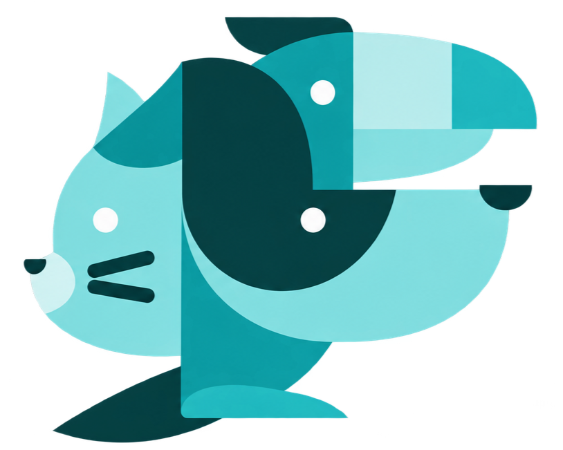

<p align="center">
  
</p>

<h1 align="center">Clínica Veterinaria del Municipio</h1>

<p align="center">
  Sistema web de gestión de cirugías para una clínica veterinaria de Quito.<br>
  Agenda sin cruces de horario, seguimiento de cada cirugía e indicadores para decidir.
</p>

<p align="center">
  
  
  
  
  
  
</p>

<p align="center">
  <strong>Demo:</strong> <a href="https://clinica-veterinaria-demo.onrender.com">clinica-veterinaria-demo.onrender.com</a> · cuentas en <a href="#datos-de-demostración">Datos de demostración</a>
</p>

<p align="center">
  <a href="https://github.com/LeandroRubio-73456/clinica-veterinaria/actions/workflows/tests.yml"></a>
  <a href="LICENSE"></a>
</p>

---

## Contexto

Programar una cirugía en una clínica veterinaria implica coordinar al mismo tiempo un veterinario, un quirófano, una mascota y su propietario. Llevado a mano, eso produce cruces de horario, cirugías sin seguimiento claro y ninguna forma de medir cómo se usan los recursos.

Este sistema centraliza toda la operación quirúrgica de la clínica: impide programar cirugías que se crucen, registra cada cambio de estado, avisa a los propietarios por correo y presenta indicadores operativos en un dashboard y en reportes exportables.

## Capturas

<p align="center">
  
  
</p>

## Funciones principales

- **Programación de cirugías** con validación de cruces de veterinario, quirófano y horario, también al editar.
- **Calendario y flujo de estados:** programada, en progreso, completada, cancelada y no presentada.
- **Dashboard en vivo** con agenda, próximas cirugías e indicadores que se actualizan sin recargar la página.
- **Propietarios y mascotas**, con creación automática de la cuenta de acceso del propietario.
- **Portal del propietario** para consultar sus mascotas y cirugías y actualizar su perfil.
- **Reportes** diarios, semanales, mensuales o por rango, con exportación a CSV y PDF.
- **Roles y permisos dinámicos** para administración, personal administrativo, veterinarios y propietarios.
- **Notificaciones** internas y por correo: confirmaciones y recordatorios de cirugía.
- **Tareas automáticas:** marcar como no presentadas las cirugías fuera de tolerancia y enviar recordatorios.

## Stack tecnológico

- Laravel 13 / PHP 8.4
- MySQL 8 (o SQLite)
- Blade + Tailwind CSS + Alpine.js
- FullCalendar para la agenda
- Pest para pruebas automatizadas, ejecutadas en GitHub Actions contra MySQL
- Docker / Laravel Sail para el entorno de desarrollo, Mailpit para correo local

## Decisiones técnicas

- **Cruces de horario resueltos en la base de datos, no solo en el formulario.** Programar o editar una cirugía ocurre dentro de una transacción que bloquea (`lockForUpdate`) las filas del veterinario y del quirófano antes de comprobar solapamientos. Así, dos personas que programan a la vez no pueden ocupar el mismo horario.
- **Los conflictos rechazados también son datos.** Cuando se rechaza una programación, el intento se guarda en `scheduling_conflicts` *después* de revertir la transacción, para que no se pierda con ella. Esto alimenta el indicador de conflictos evitados.
- **Seguridad por capas.** Un middleware de roles limita módulos completos, las policies controlan cada acción y transición de estado de una cirugía, y los Form Requests validan toda entrada antes de llegar al controlador.
- **Reglas de negocio fuera de las vistas.** Los indicadores se calculan en `ReportService` y las vistas solo presentan resultados, así una métrica no se calcula de dos formas distintas.
- **Procesos que no dependen de que alguien los recuerde.** Dos comandos programados con el scheduler de Laravel marcan como no presentadas las cirugías que superan una tolerancia configurable y envían los recordatorios por correo.

## Instalación

Requisitos: Docker Desktop (con WSL 2 en Windows).

```bash
git clone https://github.com/LeandroRubio-73456/clinica-veterinaria.git
cd clinica-veterinaria
cp .env.example .env
docker run --rm -u "$(id -u):$(id -g)" -v "$(pwd):/var/www/html" -w /var/www/html laravelsail/php84-composer:latest composer install
./vendor/bin/sail up -d
./vendor/bin/sail artisan key:generate
./vendor/bin/sail artisan migrate --seed
./vendor/bin/sail npm install
./vendor/bin/sail npm run build
```

Abre `http://localhost`. Los correos de prueba se ven en Mailpit: `http://localhost:8025`.

Instalación con XAMPP o Laragon, tareas programadas, correo SMTP y solución de problemas: [docs/instalacion.md](docs/instalacion.md).

### Datos de demostración

Para cargar un escenario completo (propietarios, mascotas, veterinarios y cirugías):

```bash
./vendor/bin/sail artisan db:seed --class=ExampleScenarioSeeder
```

Cuentas de ejemplo (todas con contraseña `password`). También funcionan en la demo en línea, donde los datos se reinician en cada arranque:

```text
Administrador:  admin@clinica.gob.ec
Administrativo: ejemplo.administrativo@clinica.local
Veterinario:    ejemplo.veterinario@clinica.local
Propietario:    ejemplo.propietario.01@clinica.local (hasta .12)
```

## Pruebas

```bash
./vendor/bin/sail artisan test
```

## Estructura del proyecto

```
app/
├── Console/Commands/   # Tareas programadas: ausencias y recordatorios
├── Http/
│   ├── Controllers/    # Un controlador por módulo
│   ├── Middleware/     # RoleMiddleware
│   └── Requests/       # Validación de cada formulario
├── Models/             # Modelos Eloquent
├── Policies/           # Autorización por acción
└── Services/           # Reportes, notificaciones y correos
docs/
├── guia-tecnica.md     # Arquitectura, flujo de una cirugía e indicadores
└── instalacion.md      # Otras formas de instalación y operación
```

La [guía técnica](docs/guia-tecnica.md) explica en detalle la arquitectura, el flujo de una cirugía, las reglas de seguridad y cómo interpretar cada indicador.

## Autor

Desarrollado por **Leandro Rubio**.

[Portafolio](https://leandrorubio-73456.github.io/portafolio/) · [LinkedIn](https://www.linkedin.com/in/leandro-rubio-369651367/) · leandrorubio456@gmail.com

## Licencia

Este proyecto está bajo la licencia [MIT](LICENSE).
