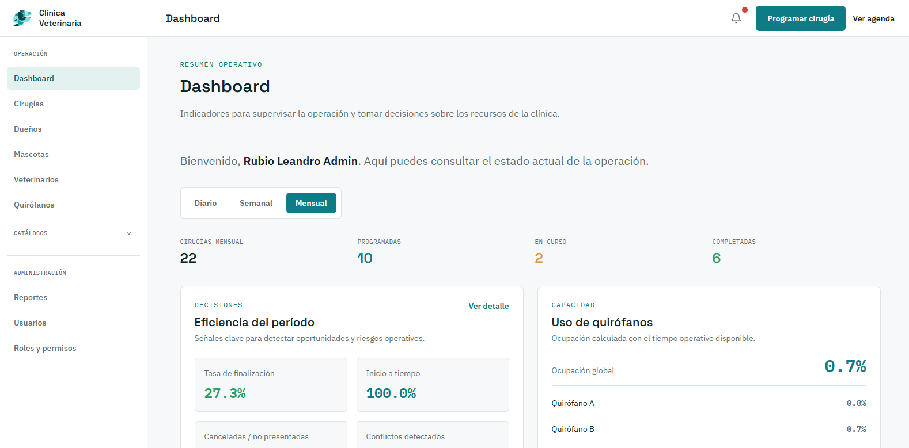
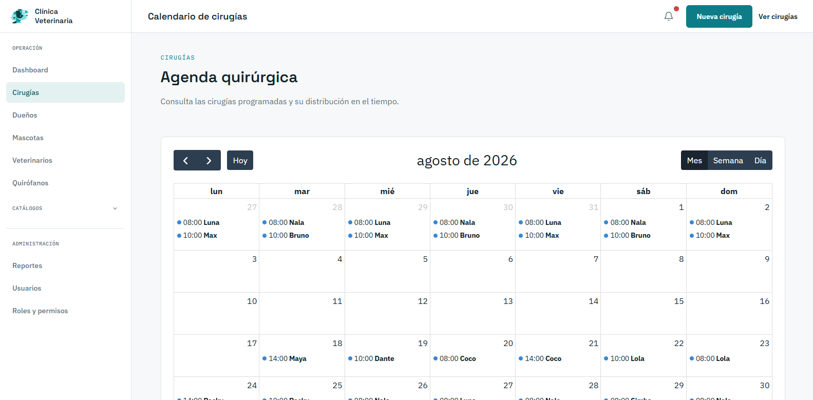

# Clínica Veterinaria del Municipio

[](https://github.com/LeandroRubio-73456/clinica-veterinaria/actions/workflows/tests.yml)

Sistema web para organizar cirugías veterinarias, propietarios, mascotas, veterinarios y quirófanos. Centraliza la agenda, evita cruces de horarios, permite dar seguimiento al estado de cada cirugía y presenta indicadores para apoyar decisiones operativas.

## Capturas

**Dashboard**



**Calendario de cirugías**



## Tecnologías

- Laravel 13 / PHP 8.4+
- MySQL
- Blade + Tailwind CSS + Alpine.js
- FullCalendar (agenda y calendario de cirugías)
- Pest (pruebas automatizadas)
- Docker / Laravel Sail para el entorno de desarrollo

## Funciones principales

- Dashboard con agenda, cirugías próximas e indicadores operativos, con actualización automática sin recargar la página.
- Registro y consulta de propietarios y mascotas, con creación automática de la cuenta de acceso del propietario (usuario y contraseña inicial basados en su cédula).
- Registro de veterinarios con creación automática de su cuenta de acceso, evitando cuentas duplicadas.
- Programación y edición de cirugías con validación de cruces de veterinario, quirófano y horario.
- Calendario de cirugías y flujo de estados: programada, en progreso, completada, cancelada y no presentada.
- Registro de motivos, notas y conflictos de agenda rechazados.
- Portal de propietarios para consultar sus mascotas y cirugías, y actualizar su perfil y contraseña.
- Reportes diarios, semanales, mensuales y por rango personalizado, con exportación a CSV y PDF.
- Usuarios, roles y permisos dinámicos.
- Notificaciones internas y correos de cirugía (confirmaciones y recordatorios).
- Comando automático para marcar como no presentadas las cirugías fuera del tiempo de tolerancia.

## Requisitos

- PHP 8.4 o superior.
- Composer 2.
- Node.js 20 o superior y npm.
- MySQL 8 o SQLite.
- Git.
- Para Docker: Docker Desktop con WSL 2 en Windows.

## Instalación con Docker / Laravel Sail

```bash
git clone https://github.com/LeandroRubio-73456/clinica-veterinaria.git
cd clinica-veterinaria
cp .env.example .env
docker run --rm -u "$(id -u):$(id -g)" -v "$(pwd):/var/www/html" -w /var/www/html laravelsail/php84-composer:latest composer install
./vendor/bin/sail artisan key:generate
./vendor/bin/sail up -d
./vendor/bin/sail artisan migrate --seed
./vendor/bin/sail npm install
./vendor/bin/sail npm run build
```

Abre `http://localhost`. Para desarrollo con actualización de estilos en caliente:

```bash
./vendor/bin/sail npm run dev
```

## Instalación con XAMPP

1. Instala PHP 8.4, Composer y Node.js. XAMPP debe tener MySQL activo.
2. Copia el proyecto dentro de `htdocs`.
3. Ejecuta `composer install` y `npm install`.
4. Copia `.env.example` a `.env`.
5. Crea una base de datos, por ejemplo `clinica_veterinaria`.
6. Configura en `.env`:

```env
APP_URL=http://localhost/clinica-veterinaria/public
DB_CONNECTION=mysql
DB_HOST=127.0.0.1
DB_PORT=3306
DB_DATABASE=clinica_veterinaria
DB_USERNAME=root
DB_PASSWORD=
```

Continúa con:

```bash
php artisan key:generate
php artisan migrate --seed
php artisan storage:link
npm run build
```

Accede a `http://localhost/clinica-veterinaria/public`. Para desarrollo, puedes usar `php artisan serve` y abrir `http://127.0.0.1:8000`.

## Instalación con Laragon

1. Copia el proyecto en `C:\laragon\www\clinica-veterinaria`.
2. Inicia Apache y MySQL desde Laragon.
3. Crea la base de datos `clinica_veterinaria`.
4. Configura `.env` con MySQL, normalmente con usuario `root` y contraseña vacía.
5. Ejecuta desde la terminal de Laragon:

```bash
composer install
copy .env.example .env
php artisan key:generate
php artisan migrate --seed
php artisan storage:link
npm install
npm run build
```

Laragon permite abrir el proyecto con `http://clinica-veterinaria.test` si el directorio está dentro de `www`.

## Datos de demostración

Para cargar un escenario completo de datos de ejemplo (propietarios, mascotas, veterinarios y cirugías):

```bash
php artisan db:seed --class=ExampleScenarioSeeder
```

Con Sail:

```bash
./vendor/bin/sail artisan db:seed
./vendor/bin/sail artisan db:seed --class=ExampleScenarioSeeder
```

Cuentas de ejemplo creadas por los seeders (todas con contraseña `password`):

```text
Administrador:  admin@clinica.gob.ec
Administrativo: ejemplo.administrativo@clinica.local
Veterinario:    ejemplo.veterinario@clinica.local
Propietario:    ejemplo.propietario.01@clinica.local (hasta ejemplo.propietario.12@clinica.local)
```

## Automatizaciones

En `routes/console.php` se programan cada minuto:

```bash
php artisan surgeries:mark-no-show
php artisan surgeries:send-reminders
```

En producción se debe mantener activo el scheduler de Laravel. En desarrollo puede ejecutarse:

```bash
php artisan schedule:work
```

Para procesar la cola de correos:

```bash
php artisan queue:work
```

## Correo

El correo local de Docker usa Mailpit en `http://localhost:8025`. Para un proveedor SMTP real, configura `MAIL_MAILER=smtp` y las credenciales correspondientes en `.env`. No publiques contraseñas SMTP en el control de versiones.

## Pruebas

```bash
php artisan test
```

Con Sail:

```bash
./vendor/bin/sail artisan test
```

## Documentación adicional

Consulta [`docs/guia-tecnica.md`](docs/guia-tecnica.md) para una descripción de la arquitectura, el flujo de una cirugía, las reglas de seguridad y la interpretación de los indicadores de reportes.

## Solución rápida de problemas

```bash
php artisan optimize:clear
php artisan migrate:status
php artisan storage:link
```

Si aparece un error de permisos en Docker, ejecuta los comandos Artisan dentro del contenedor mediante Sail y verifica que la carpeta del proyecto tenga permisos de escritura para `storage` y `bootstrap/cache`.

## Seguridad

Las credenciales de los seeders son únicamente para demostración. En una instalación real cambia las contraseñas, configura `APP_DEBUG=false`, usa HTTPS y define un correo SMTP seguro.

## Licencia

Este proyecto está bajo la licencia [MIT](LICENSE).
